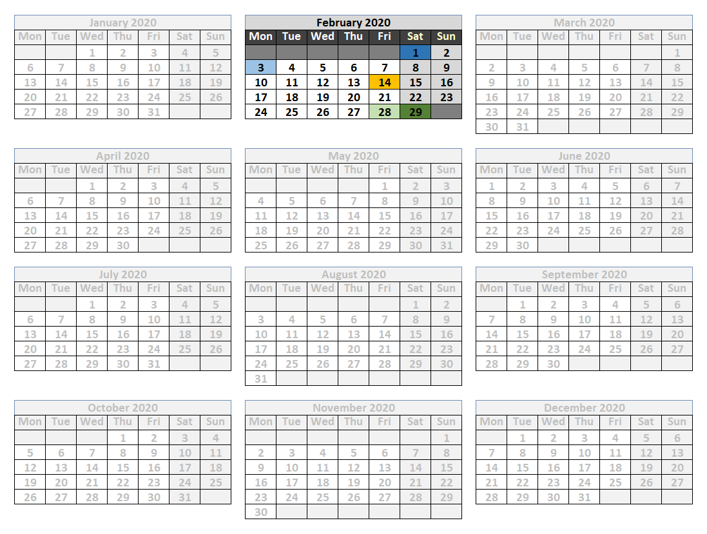
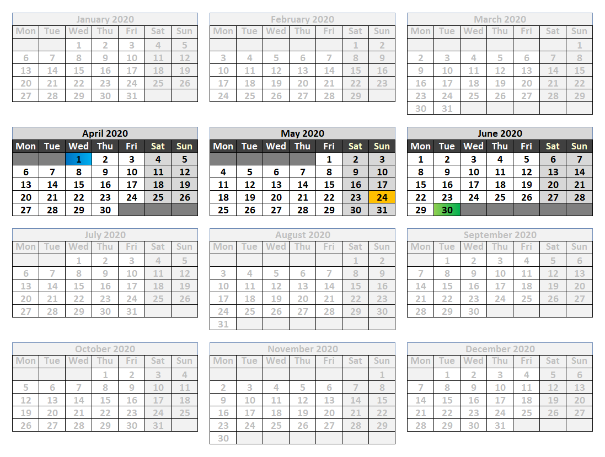
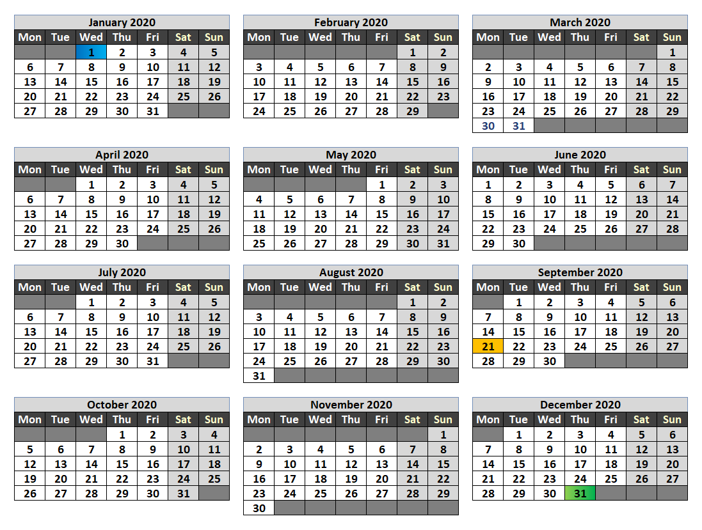
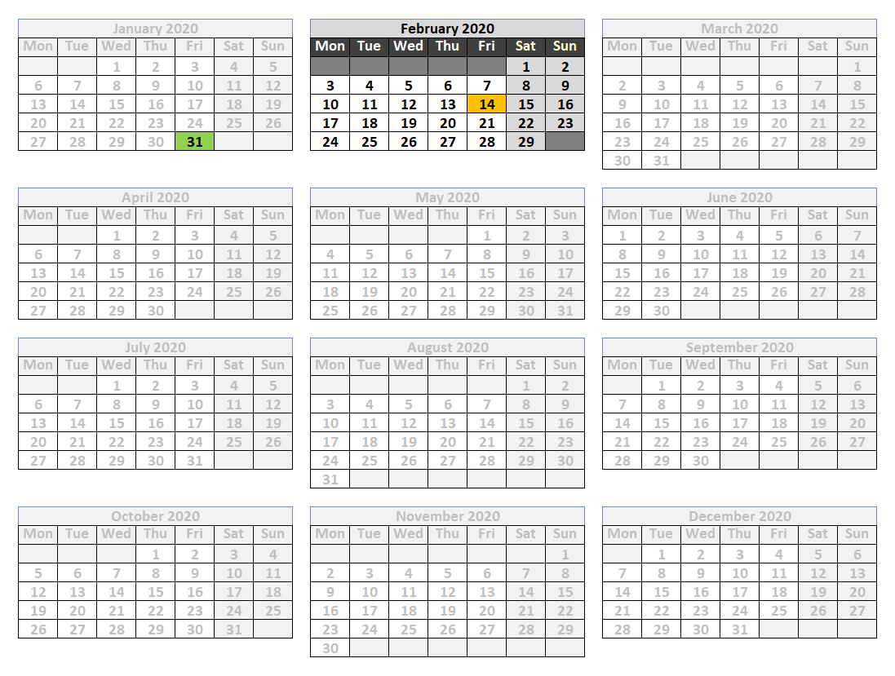
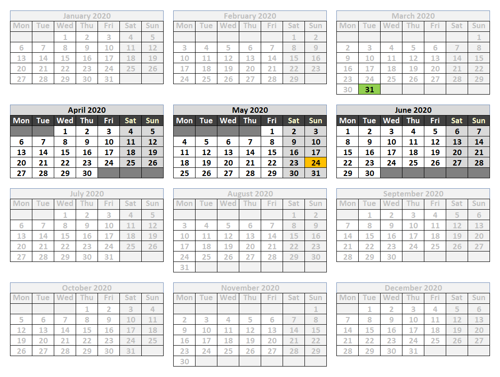
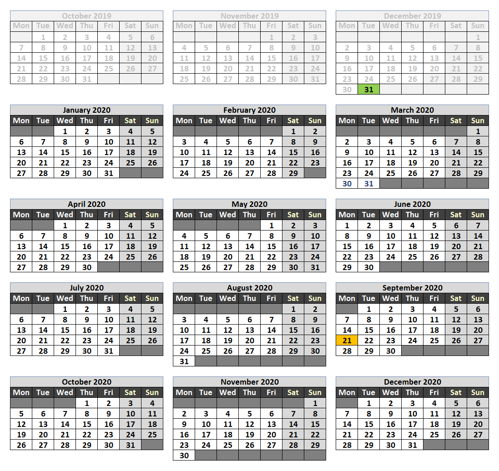

```{r, include = FALSE}
knitr::opts_chunk$set(
  collapse = TRUE,
  comment = "#>"
)
```

```{r setup}
library(actuaryr)
```

# Date reference functions

First and last days of months, quarters and years are of special meaning 
for business reporting.

The business reports are usually created for the last day of some period, 
like a month or a year. They enclose data for the first day of this period up 
to the last. If you create your report in the middle of the period, you may 
need to quickly refer to these dates.

The `dref_` prefix stands for **d**ate **ref**erence functions. 
The functions with the `dref_` prefix return a reference date to the base 
date.

## Reference dates within a time period

The functions work within three types of periods:

* a month
* a quarter
* an year

The functions return one of the four types of reference dates:

* the first day
* the first working day
* the last day
* the last working day

The names of functions combine the `dref_` prefix and the first letters 
of the chosen reference date.

For example, `dref_fdoy()` returns the **f**irst **d**ay **o**f an **y**ear.

The table summarizes all date reference functions.

|                   | of month       | of quarter     | of year        |
|-------------------|----------------|----------------|----------------|
| first day         | `dref_fdom()`  | `dref_fdoq()`  | `dref_fdoy()`  |
| first working day | `dref_fwdom()` | `dref_fwdoq()` | `dref_fwdoy()` |
| last day          | `dref_ldom()`  | `dref_ldoq()`  | `dref_ldoy()`  |
| last working day  | `dref_lwdom()` | `dref_lwdoq()` | `dref_lwdoy()` |

All functions take the argument `date`, which is the base date.
The functions return the result in reference to the base date.
The functions always work within a specific period: a month, a quarter 
or an year.

### Monthly periods

The reference dates in the image below can be retrieved 
with the following functions:

* `dref_fdom()` - dark blue
* `dref_fwdom()` - light blue
* `dref_ldom()` - light green
* `dref_lwdom()` - dark green

The base date has been marked with orange.

```{r, echo = FALSE, out.width = "600px"}

```

```{r}
dref_fdom("2020-02-14")
dref_fwdom("2020-02-14")
dref_ldom("2020-02-14")
dref_lwdom("2020-02-14")
```


### Quarterly periods

The reference dates in the image below can be retrieved 
with the following functions:

* `dref_fdoq()` - dark blue
* `dref_fwdoq()` - light blue
* `dref_ldoq()` - light green
* `dref_lwdoq()` - dark green

The base date has been marked with orange.

**Watch out!** 
The first day in this time period is the same as the first working day 
in this time period. The last day of this time period is the same as 
the last working day of this time period.
Hence, the same day is marked with two colors (darker and lighter).

```{r, echo = FALSE, out.width = "600px"}

```

```{r}
dref_fdoq("2020-05-24")
dref_fwdoq("2020-05-24")
dref_ldoq("2020-05-24")
dref_lwdoq("2020-05-24")
```

### Yearly periods

The reference dates in the image below can be retrieved 
with the following functions:

* `dref_fdoy()` - dark blue
* `dref_fwdoy()` - light blue
* `dref_ldoy()` - light green
* `dref_lwdoy()` - dark green

The base date has been marked with orange.

**Watch out!** 
The first day in this time period is the same as the first working day 
in this time period. The last day of this time period is the same as 
the last working day of this time period.
Hence, the same day is marked with two colors (darker and lighter).

```{r, echo = FALSE, out.width = "600px"}

```

```{r}
dref_fdoy("2020-09-21")
dref_fwdoy("2020-09-21")
dref_ldoy("2020-09-21")
dref_lwdoy("2020-09-21")
```

## Reference dates from the previous period

The functions return the last day of the previous month, quarter or year.
These functions might be of use if, for example, you are preparing
the results for the first quarter of 2020 (Q1 2020) and want to compare them
against the year-end results (YE 2019).

The functions are:

* `dref_mtd()` - returns month-to-date
* `dref_qtd()` - returns quarter-to-date
* `dref_ytd()` - returns year-to-date

There is no distinction for days and working days. 
`dref_mtd()`, `dref_qtd()` and `dref_ytd()` always return the last day 
of the preceding time period.

In the images below, the base dates have been marked with orange 
and the reference dates have been marked with green.

### Month-to-date

```{r, echo = FALSE, out.width = "600px"}

```

```{r}
dref_mtd("2020-02-14")
```

### Quarter-to-date

```{r, echo = FALSE, out.width = "600px"}

```

```{r}
dref_qtd("2020-05-24")
```

### Year-to-date

```{r, echo = FALSE, out.width = "600px"}

```

```{r}
dref_ytd("2020-09-21")
```

# Compare

`compare()` compares two tables. It returns a table with the result of 
a comparison. 

For numericals, the result is the difference between the two corresponding 
values. Hence, zero implies no difference. For characters, the result is either 
`the_same` or `different`.

## The same tables

For two exact tables with numerical values, the result table will contain only
zeros.

```{r}
x1 <- data.frame(
  x = rep(1, 3),
  y = rep(2, 3),
  z = rep(3, 3)
)

y1 <- data.frame(
  x = rep(1, 3),
  y = rep(2, 3),
  z = rep(3, 3)
)

compare(x1, y1)
```

For two exact tables with characters, the result table will contain `the_same`
strings.


# Coding standard

* function names - lower-case, underscore separated, e.g. `dref_ldom()`
* arguments - lower-case, dot separated, e.g. `from.type` 
